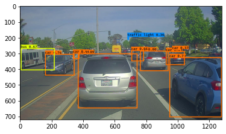

# Autonomous Driving: Real-Time Car Detection with YOLO


*(Demonstration of the YOLO model detecting cars in a video stream)*

This repository contains a implementation of the YOLO (You Only Look Once) algorithm for object detection, applied to a real-world autonomous driving dataset. The model is capable of identifying and drawing bounding boxes around cars in real-time.

This project is an implementation of the "Autonomous Driving - Car Detection" assignment from the **DeepLearning.AI Convolutional Neural Networks** course on Coursera.

## Table of Contents
- [Project Overview](#project-overview)
- [The YOLO Algorithm](#the-yolo-algorithm)
  - [Core Idea: "You Only Look Once"](#core-idea-you-only-look-once)
  - [Model Architecture](#model-architecture)
- [Key Implementation Steps](#key-implementation-steps)
  - [1. Filtering with a Score Threshold](#1-filtering-with-a-score-threshold)
  - [2. Intersection over Union (IoU)](#2-intersection-over-union-iou)
  - [3. Non-Max Suppression (NMS)](#3-non-max-suppression-nms)
- [Results](#results)
- [How to Run](#how-to-run)
  - [Prerequisites](#prerequisites)
  - [Installation & Execution](#installation--execution)
- [Acknowledgements](#acknowledgements)

## Project Overview

The primary goal of this project is to build and understand a car detection system for an autonomous vehicle. Using a pre-trained YOLOv2 model, this implementation processes images of a road and outputs bounding boxes for detected objects, primarily cars.

The project walks through the critical post-processing steps required to interpret the raw output of a YOLO model, turning a dense prediction tensor into a clean, usable set of object detections.

## The YOLO Algorithm

YOLO is a state-of-the-art, real-time object detection system. Its popularity stems from its ability to achieve high accuracy while running at speeds that allow for real-time applications.

### Core Idea: "You Only Look Once"
Unlike traditional sliding window or region proposal-based techniques, YOLO sees the entire image during training and test time, so it implicitly encodes contextual information about classes as well as their appearance.

1.  The input image is divided into an S x S grid (in this project, 19x19).
2.  If the center of an object falls into a grid cell, that grid cell is responsible for detecting that object.
3.  Each grid cell predicts a number of bounding boxes (5 in this project) and confidence scores for those boxes.
4.  Each box prediction consists of its coordinates (`bx, by, bh, bw`), a confidence score (`pc`), and class probabilities for all 80 COCO classes.

### Model Architecture

The project uses a pre-trained YOLOv2 model. The model's architecture can be summarized as:

**Input Image (608, 608, 3) -> Deep CNN -> Output Tensor (19, 19, 5, 85)**


The output tensor shape `(19, 19, 5, 85)` breaks down as:
- **19x19:** The grid size.
- **5:** The number of anchor boxes predicted per grid cell.
- **85:** The values for each prediction:
    - 5 values for the bounding box: `(pc, bx, by, bh, bw)`
    - 80 values for the class probabilities (for the 80 classes in the COCO dataset).

## Key Implementation Steps

The core of this project lies in processing the model's raw output tensor. The following functions were implemented from scratch to achieve this.

### 1. Filtering with a Score Threshold
The model produces thousands of potential bounding boxes. The first step is to discard boxes with low confidence. A box's final score is the product of its confidence that an object exists (`pc`) and the probability of the most likely class. Any box with a score below a set threshold (e.g., 0.6) is discarded.

### 2. Intersection over Union (IoU)
IoU is a fundamental metric used to measure the extent of overlap between two bounding boxes. It is the ratio of the area of intersection to the area of union. This function is a critical helper for the next step, Non-Max Suppression.


### 3. Non-Max Suppression (NMS)
After thresholding, the model may still have multiple overlapping boxes for the same object. NMS is used to clean this up:
1.  Select the box with the highest score.
2.  Calculate its IoU with all other boxes of the same class.
3.  Discard any box with an IoU above a certain threshold (e.g., 0.5).
4.  Repeat for the next highest-scoring box until all boxes are processed.

This ensures that only the single best bounding box is kept for each detected object.

## Results

The implemented pipeline was tested on sample images from the Drive.ai dataset. The model successfully identifies cars, buses, and other objects with accurate bounding boxes.


The final result is a system that can take an image and return a clean list of detected objects, ready for use in a higher-level autonomous driving application.

## How to Run

### Prerequisites
- Python 3.7
- `pip` and `venv` for package management
- The pre-trained model `yolo.h5` and the `yad2k` utility library (included in this repository).

### Installation & Execution

1.  **Clone the repository:**
    ```bash
    git clone https://github.com/vinitborad/car-detection-using-yolo.git
    cd car-detection-using-yolo
    ```

2.  **Create and activate a virtual environment:**
    ```bash
    # For Windows
    python -m venv venv
    .\venv\Scripts\activate

    # For macOS/Linux
    python3 -m venv venv
    source venv/bin/activate
    ```

3.  **Install the required packages:**
    ```bash
    pip install -r requirements.txt
    ```

4.  **Run the Jupyter Notebook:**
    ```bash
    jupyter notebook "Autonomous Driving - Car Detection.ipynb"
    ```
    You can run the cells sequentially to see the implementation and test the `predict` function on sample images located in the `/images` folder.

## Acknowledgements
- This project is based on the curriculum and starter code provided by the **DeepLearning.AI Convolutional Neural Networks** course on [Coursera](https://www.coursera.org/learn/convolutional-neural-networks).
- The car detection dataset was provided by **Drive.ai**.
- The Keras implementation and pre-trained weights were adapted from Allan Zelener's [YAD2K repository](https://github.com/allanzelener/YAD2K).